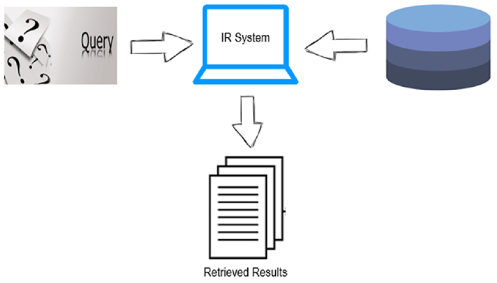

# Retrieving Information (IR)
Information retrieval is one of the highly used applications of NLP and it is
quite tricky. The meaning of the words or sentences not only depends on
the exact words used but also on the context and meaning. Two sentences
may be of completely different words but can convey the same meaning.
We should be able to capture that as well.
An information retrieval (IR) system allows users to efficiently
search documents and retrieve meaningful information based on a
search text/query

## About the previous Notebook
In the previous notebook I implemented IR system depending on word embeddings (word2vec) 